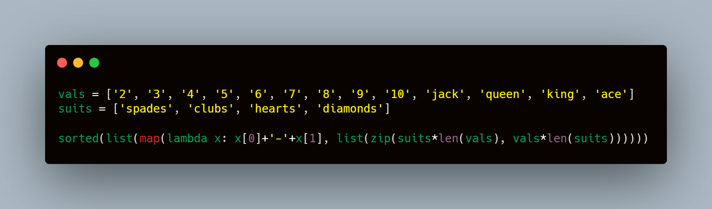
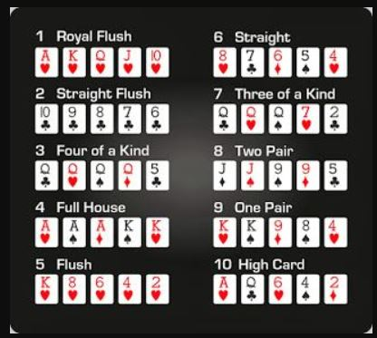

# Assignment 6

## Problem Statement

- Write a single expression that includes lambda, zip and map functions to select create 52 cards in a deck - 50 pts
- Write a normal function without using lambda, zip, and map function to create 52 cards in a deck - 50 pts
- Write a function that, when given 2 sets of 3 or 4 or 5 cards (1 game can only have 3 cards with each player or 4 cards or 5 cards per player) (1 deck of cards only), (2 players only), can identify who won the game of poker 

## Target

- Basics (applicable to 2/3 above):
- Proper readme file - 50 (if not there then 0)
- Docstrings must, and it must mention what the function is doing (2, 3) - 50
- Write annotations for 3 - 50 pts
- Basics tests to ensure your code if correct (20+ combination tests (counted as 1 test) in 3, check 1/2 with a manual list of 52 cards. Overall 20 tests at minimum) - 200 pts
- Submit Github link with all test files and github actions in place. 

#  Functions Implemented 

## get_player_score(a:list) -> dict
    Checks the cards, identifies and computes a score of user's deck

## get_my_deck_normally
    Returns a deck of 52 cards when function is called using normal string

## kinda_poker(a:list, b:list) -> list
    Checks the type of cards and computes a score to predict who wins

## get_deck_oneline()
    single expression that includes lambda, zip and map functions to select create 52 cards in a deck

# Algorithm for Poker

 > Never played poker before, hence mentioning my understanding of the game which explains the logic of code

- Player who has superior cards wins the round
- Player can have 3,4,5 cards
- Both players should have same no of cards when comparing
- Winning priority is as per the image above from Ranks 1 - 10

    - Rank_1 - Royal Flush - All the big cards consequitively of same suits
    - Rank_2 - Straight Flush - All cards consequitively of same suits
    - Rank_3 - Four of a Kind - All the same vals cards but of different suits. Valid only when you have 4 or 5 cards
    - Rank_4 - Full House - A Triplet and a duplet of same vals but with different suits
    - Rank_5 - Flush - All the cards of same suits
    - Rank_6 - Straight - All the cards consequitively but of differnt suits
    - Rank_7 - Three of a Kind - Triplets of cards with same vals but different suits
    - Rank_8 - Two Pair - 2 Duplets of cards with same vals, but different suits
    - Rank_9 - One Pair -  1 Duplet of cards with same vals, but different suits
    - Rank_10 - High Card  - Cards which matches none of any above matching patterns :P

# Testcases Implemented

## test_readme_exists
    Checks if README.md exists

## test_readme_contents
    Contents of readme file has been properly written or not

## test_readme_file_for_formatting
    Checks for Readme File formatting

## test_function_name_had_cap_letter
    Raises error if Functions has capital letter

## test_incorrect_value
    Sends an invalid input as cards to check if code is raising error

## test_3_players
    Checks the code behaviour when 3 values are sent as inputs instead of 2

## test_6_cards
    Checks the code behaviour when 6 cards are sent as inputs instead of range(3,6)

## test_poker_doc
    Checks if the poker function has docstrings or not

## test_poker_annotations
    Checks if the poker function has annotations or not

## test_sattebaazi
    Sends two inputs as lists of different decks 21 times,
    and validates the output from the scoring function

## test_royalflush
     Tests the properties when RoyalFlush is sent as Input
    a = ['ace-hearts', 'queen-hearts', 'king-hearts']

## test_straightflush
    Tests the properties when StraightFlush is sent as Input

## test_fourkind
    Tests the properties when Four of a kind is sent as Input

 ## test_fullhouse
    Tests the properties when Full House is sent as Input

## test_flush
    Tests the properties when Flush is sent as Input

## test_straight
    Tests the properties when straight is sent as Input

## test_three_kind
    Tests the properties when three of a kind is sent as Input

## test_two_pair
    Tests the properties when two_pair is sent as Input

## test_one_pair
    Tests the properties when one_pair is sent as Input

## test_high_card
    Tests the properties when high_card is sent as Input

## test_score_doc
    Checks if the score function has docstrings or not

## test_score_annotations
    Checks if the score function has annotations or not

## test_indentations
     Returns pass if used four spaces for each level of syntactically significant indenting

## test_normal_deck
    Checks the deck generated by one line is correct or not

## test_oneliner_deck
    Checks the deck generated by one line is correct or not

## test_match_decks
    Checks the  output matches of both decks

## test_oneliner_doc
    Checks if the oneliner function has docstrings or not

## test_oneliner_annotations
    Checks if the oneliner function has annotations or not

## test_normal_deck_doc
    Checks if the normal_deck function has docstrings or not

## test_normal_deck_annotations
    Checks if the normal_deck function has annotations or not